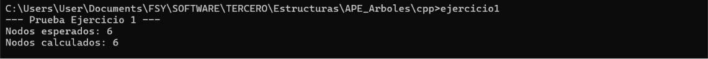
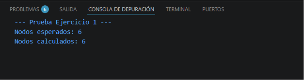
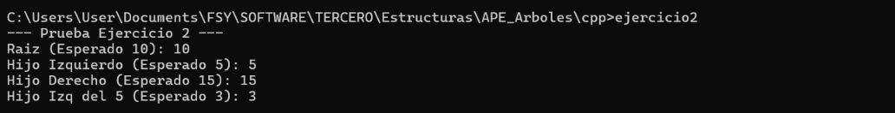
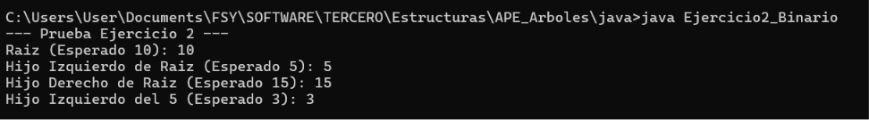
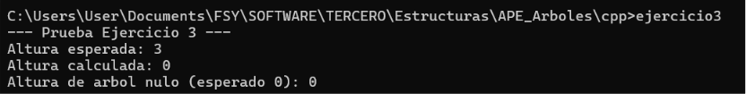
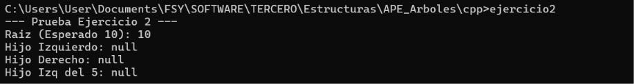
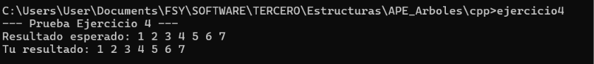
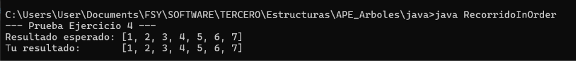
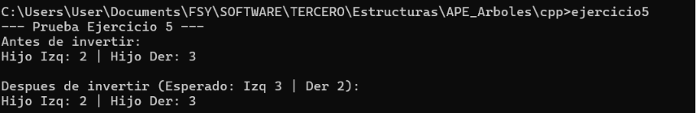
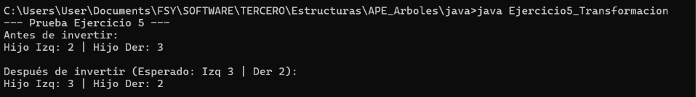

# Práctica de Estructuras de Datos: Árboles

El objetivo de este repositorio es proporcionarles un entorno práctico donde puedan aplicar los conceptos teóricos vistos en clase relacionados con árboles N-arios, árboles binarios, recorridos y transformaciones.

## Objetivos de Aprendizaje

Al completar estos ejercicios, serán capaces de:
1. Comprender y manipular la estructura básica de nodos con múltiples hijos y nodos binarios.
2. Implementar la lógica de inserción en un Árbol Binario de Búsqueda (BST).
3. Utilizar la recursividad para calcular métricas estructurales, como la profundidad máxima.
4. Extraer datos mediante recorridos estándar (In-Order).
5. Modificar la estructura subyacente de los punteros para transformar un árbol.

## Estructura del Repositorio

El repositorio contiene 5 ejercicios, cada uno debe ser hecho en c++ y java

1. Ejercicio 1: Árboles Básicos (Conteo de nodos en árboles N-arios).
2. Ejercicio 2: Árbol Binario (Inserción en BST).
3. Ejercicio 3: Árbol Binario (Cálculo de profundidad máxima).
4. Ejercicio 4: Recorridos (Implementación de In-Order).
5. Ejercicio 5: Transformación (Inversión o árbol espejo).

## Instrucciones para el Desarrollo

1. Dentro de cada archivo encontrarán la estructura básica de las clases (o structs) y la definición de un método específico que deben completar. 
2. Localicen el comentario `TODO: Implementa tu lógica aquí`. Esa es la única sección del código que necesitan modificar.
3. No es necesario modificar el método `main`. Este método ya contiene la construcción de un árbol de prueba y las impresiones necesarias para validar que su algoritmo funciona correctamente.
4. Su objetivo es lograr que, al ejecutar el código, los resultados calculados coincidan con los resultados esperados impresos en la consola.

------------------------------------------------------------------------
#  APE_ARBOLES — Práctica de Árboles

Repositorio de ejercicios sobre estructuras de datos tipo **árbol**, implementados en **C++** y **Java**. Cubre desde árboles N-arios básicos hasta transformaciones avanzadas.

---

##  Estructura del Proyecto

```
APE_ARBOLES/
└── assets/
    ├── ES-APE3-EJ1.png         # Prueba de ejecución C++ - Ejercicio 1
    ├── ES-APE3-EJ2.png         # Prueba de ejecución C++ - Ejercicio 2
    ├── ES-APE3-EJ3.png         # Prueba de ejecución C++ - Ejercicio 3
    ├── ES-APE3-EJ4.png         # Prueba de ejecución C++ - Ejercicio 4
    ├── ES-APE3-EJ5.png         # Prueba de ejecución C++ - Ejercicio 5
    ├── ES-APE3-JAVA-EJ1.png    # Prueba de ejecución Java - Ejercicio 1
    ├── ES-APE3-JAVA-EJ2.png    # Prueba de ejecución Java - Ejercicio 2
    ├── ES-APE3-JAVA-EJ3.png    # Prueba de ejecución Java - Ejercicio 3
    ├── ES-APE3-JAVA-EJ4.png    # Prueba de ejecución Java - Ejercicio 4
    └── ES-APE3-JAVA-EJ5.png    # Prueba de ejecución Java - Ejercicio 5
```

---

##  Ejercicios

---

### Ejercicio 1 — Árboles Básicos: Conteo de Nodos en Árboles N-arios

**Descripción:**  
Implementación de un árbol N-ario donde cada nodo puede tener un número arbitrario de hijos. El objetivo es recorrer el árbol y contar el total de nodos presentes.

**Cambios en C++:**
- Se definió la estructura `NodoN` con un valor entero y un vector de punteros a hijos (`vector<NodoN*>`).
- Se implementó la función recursiva `contarNodos(NodoN* raiz)` que suma 1 por cada nodo visitado.
- Se liberó la memoria dinámicamente al finalizar.

**Cambios en Java:**
- Se creó la clase `NodoN` con atributo `valor` y `List<NodoN> hijos`.
- Se implementó el método estático `contarNodos(NodoN raiz)` con recursión sobre la lista de hijos.
- Se utilizó `ArrayList` para manejar los hijos de forma dinámica.

**Pruebas de ejecución:**

| C++ | Java |
|-----|------|
|  |  |

---

### Ejercicio 2 — Árbol Binario: Inserción en BST

**Descripción:**  
Implementación de un Árbol Binario de Búsqueda (BST). Se insertan valores de forma que los nodos menores quedan a la izquierda y los mayores a la derecha, manteniendo la propiedad de ordenamiento del BST.

**Cambios en C++:**
- Se definió la estructura `NodoBST` con `valor`, `izquierdo` y `derecho`.
- Se implementó `insertar(NodoBST* raiz, int val)` de forma recursiva comparando el valor con el nodo actual.
- Se añadió un recorrido in-order para verificar la correcta inserción.

**Cambios en Java:**
- Se creó la clase `NodoBST` con atributos `valor`, `izquierdo` y `derecho`.
- Se implementó el método `insertar(NodoBST raiz, int val)` retornando el nodo actualizado.
- Se validó la inserción mediante impresión in-order.

**Pruebas de ejecución:**

| C++ | Java |
|-----|------|
|  |  |

---

### Ejercicio 3 — Árbol Binario: Cálculo de Profundidad Máxima

**Descripción:**  
Dado un árbol binario, se calcula su profundidad máxima, es decir, la longitud del camino más largo desde la raíz hasta una hoja.

**Cambios en C++:**
- Se implementó la función `profundidadMaxima(NodoBST* raiz)` que retorna `0` si el nodo es nulo.
- Se calcula recursivamente la profundidad de los subárboles izquierdo y derecho, retornando el máximo más 1.

**Cambios en Java:**
- Se implementó el método estático `profundidadMaxima(NodoBST raiz)` con la misma lógica recursiva.
- Se utilizó `Math.max()` para comparar profundidades de ambos subárboles.

**Pruebas de ejecución:**

| C++ | Java |
|-----|------|
|  |  |

---

### Ejercicio 4 — Recorridos: Implementación de In-Order

**Descripción:**  
Implementación del recorrido **In-Order** (izquierda → raíz → derecha) sobre un árbol binario. Este recorrido produce los elementos en orden ascendente cuando se aplica sobre un BST.

**Cambios en C++:**
- Se implementó la función `inOrder(NodoBST* raiz)` que visita recursivamente el subárbol izquierdo, imprime el valor del nodo actual y luego visita el subárbol derecho.
- Se verificó que la salida coincide con el orden ascendente de los valores insertados.

**Cambios en Java:**
- Se implementó el método `inOrder(NodoBST raiz)` con la misma secuencia: izquierda → nodo → derecha.
- Se usó `System.out.print()` para mostrar los valores en una sola línea separados por espacios.

**Pruebas de ejecución:**

| C++ | Java |
|-----|------|
|  |  |

---

### Ejercicio 5 — Transformación: Inversión / Árbol Espejo

**Descripción:**  
Se transforma un árbol binario en su **espejo**, intercambiando recursivamente los subárboles izquierdo y derecho de cada nodo. El resultado es la imagen especular del árbol original.

**Cambios en C++:**
- Se implementó la función `invertirArbol(NodoBST* raiz)` que intercambia los punteros `izquierdo` y `derecho` de cada nodo mediante recursión post-orden.
- Se imprimió el recorrido in-order antes y después de la inversión para verificar el resultado.

**Cambios en Java:**
- Se implementó el método `invertirArbol(NodoBST raiz)` siguiendo la misma lógica de intercambio.
- Se realizó la verificación imprimiendo el árbol en in-order antes y después de aplicar la transformación.

**Pruebas de ejecución:**

| C++ | Java |
|-----|------|
|  |  |

---

##  Tecnologías Utilizadas

- **C++17** — Compilado con `g++`
- **Java 17** — Compilado con `javac`

---

##  Autor

Práctica desarrollada como parte de la asignatura de **Algoritmos y Programación**.
